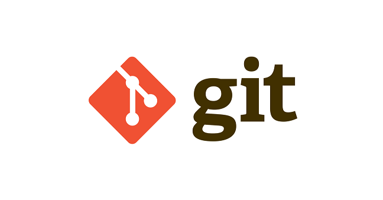

```mermaid
graph TB
    1[Check list of branch : <br> git branch -a ] -->2[Create a new branch Develop and switch to the branch : <br> git checkout -b new branch Develop]
    2 --> 3[switch to the branch Dev2 : <br> git checkout Dev2]
    3-->4[check the status for all files inside the current branch : <br> git status <br> <br> You can also handled files with : <br>  use : git add <file>...  to update what will be committed <br> use git restore <file>... to discard changes in working directory ]
    4-->5["To stash your working directory including untracked files (especially those that are in the .gitignore) : <br> git stash --include-untracked"]
    5-->6[check the status for all files inside the current branch : <br> git status]
    6-->7[switch to Develop branch <br> git checkout Develop]
    7-->12[write working from top of stash stack <br> git stash pop]
    12-->8[update all changement : <br> git add .]
    8-->9[check the status for all files inside the current branch : <br> git status]
    9-->10[commit your changement locally : <br> git commit]
    10-->11[push your changement online : <br> git push <br><br> When it's a new branch that you create locally and want to push it to our repository online then you need to : <br> git push --set-upstream origin Develop <br> because in this case the current branch Develop has no upstream branch.]
```    

# 🚀 Git Cheat Sheet 🚀 <!-- omit in TOC -->


<div align="center">



</div>

- [Setup](#setup)
- [Setup & Init](#setup--init)
- [stage & snapshot](#stage--snapshot)
- [branch & merge](#branch--merge)
- [Inspect & Compare](#inspect--compare)
- [Tracking path changes](#tracking-path-changes)
- [Ignoring patterns](#ignoring-patterns)
- [Share & Update](#share--update)
- [Rewrite history](#rewrite-history)
- [Temporary commits](#temporary-commits)
- [Create a new branch loccally and push it online after adding changement to it](#create-a-new-branch-loccally-and-push-it-online-after-adding-changement-to-it)
- [Source :](#source-)

<br>
<br>

___

## Setup
Configuring user information used across all local repositories

<details>
<summary>set a name that is identifiable for credit when review version history</summary>

```
git config --global user.name “[firstname lastname]”
```

<br>
</details>

<details>
<summary>set an email address that will be associated with each history marker</summary>

```
git config --global user.email “[valid-email]”
```

<br>
</details>

<details>
<summary>set automatic command line coloring for Git for easy reviewing</summary>

```
git config --global color.ui auto
```

<br>
</details>


<br>
<br>

___
## Setup & Init
Configuring user information, initializing and cloning repositories

<details>
<summary>initialize an existing directory as a Git repository</summary>

```
git init
```

<br>
</details>


<details>
<summary>retrieve an entire repository from a hosted location via URL</summary>

```
git clone [url]
```

<br>
</details>


<details>
<summary>retrieve a specific repository from a hosted location via URL</summary>

```
git clone [url] --branch [Name_of_your_specific_branch]
```

<br>
</details>


<br>
<br>

___

## stage & snapshot
Working with snapshots and the Git staging area

<details>
<summary>show modified files in working directory, staged for your next commit</summary>

```
git status
```

<br>
</details>


<details>
<summary>add a file as it looks now to your next commit (stage)</summary>

```
git add [file]
```

<br>
</details>


<details>
<summary>unstage a file while retaining the changes in working directory</summary>

```
git reset [file]
```

<br>
</details>

<details>
<summary>diff of what is changed but not staged</summary>

```
git diff
```

<br>
</details>

<details>
<summary>diff of what is staged but not yet commited</summary>

```
git diff --staged
```

<br>
</details>


<details>
<summary>commit your staged content as a new commit snapshot</summary>

```
git commit -m “[descriptive message]”
```

<br>
</details>


<br>
<br>

___

## branch & merge
Isolating work in branches, changing context, and integrating changes
<details>
<summary>list your branches. a * will appear next to the currently active branch</summary>

```
git branch
```

<br>
</details>


<details>
<summary>create a new branch at the current commit</summary>

```
git branch [branch-name]
```

<br>
</details>


<details>
<summary>switch to another branch and check it out into your working directory</summary>

```
git checkout
```

<br>
</details>


<details>
<summary>merge the specified branch’s history into the current one</summary>

```
git merge [branch]
```

<br>
</details>


<details>
<summary>show all commits in the current branch’s history</summary>

```
git log
```

<br>
</details>


<br>
<br>

___

## Inspect & Compare
Examining logs, diffs and object information


<details>
<summary>show the commit history for the currently active branch</summary>

```
git log
```

<br>
</details>


<details>
<summary>show the commits on branchA that are not on branchB</summary>

```
git log branchB..branchA
```

<br>
</details>


<details>
<summary>show the commits that changed file, even across renames</summary>

```
git log --follow [file]
```

<br>
</details>


<details>
<summary>show the diff of what is in branchA that is not in branchB</summary>

```
git diff branchB...branchA
```

<br>
</details>


<details>
<summary>show any object in Git in human-readable format</summary>

```
git show [SHA]
```

<br>
</details>


<br>
<br>

___
## Tracking path changes
Versioning file removes and path changes

<details>
<summary>delete the file from project and stage the removal for commit</summary>

```
git rm [file]
```

<br>
</details>

<details>
<summary>change an existing file path and stage the move</summary>

```
git mv [existing-path] [new-path]
```

<br>
</details>

<details>
<summary>show all commit logs with indication of any paths that moved</summary>

```
git log --stat -M
```

<br>
</details>

<br>
<br>

___
## Ignoring patterns
Preventing unintentional staging or commiting of files

<details>
<summary>Save a file with desired paterns as .gitignore with either direct string matches or wildcard globs.</summary>

```
logs/
*.notes
pattern*/
```

<br>
</details>

<details>
<summary>system wide ignore patern for all local repositories</summary>

```
git config --global core.excludesfile [file]
```

<br>
</details>


<br>
<br>

___
## Share & Update
Retrieving updates from another repository and updating local repos

<details>
<summary>add a git URL as an alias</summary>

```
git remote add [alias] [url]
```

<br>
</details>

<details>
<summary>fetch down all the branches from that Git remote</summary>

```
git fetch [alias]
```

<br>
</details>

<details>
<summary>merge a remote branch into your current branch to bring it up to date</summary>

```
git merge [alias]/[branch]
```

<br>
</details>

<details>
<summary>Transmit local branch commits to the remote repository branch</summary>

```
git push [alias] [branch]
```

<br>
</details>

<details>
<summary>fetch and merge any commits from the tracking remote branch</summary>

```
git pull
```

<br>
</details>

<br>
<br>

___
## Rewrite history
Rewriting branches, updating commits and clearing history

<details>
<summary>apply any commits of current branch ahead of specified one</summary>

```
git rebase [branch]
```

<br>
</details>

<details>
<summary>clear staging area, rewrite working tree from specified commit</summary>

```
git reset --hard [commit]
```

<br>
</details>

<br>
<br>

___

## Temporary commits
Temporarily store modified, tracked files in order to change branches

<details>
<summary>Save modified and staged changes</summary>

```
git stash
```

<br>
</details>

<details>
<summary>list stack-order of stashed file changes</summary>

```
git stash list
```

<br>
</details>

<details>
<summary>write working from top of stash stack</summary>

```
git stash pop
```

<br>
</details>

<details>
<summary>discard the changes from top of stash stack</summary>

```
git stash drop
```

<br>
</details>


<br>
<br>

___

## Create a new branch loccally and push it online after adding changement to it

Here we do the step for :
1. Create a branch using the current branch as bases : ```git checkout -b new branch Develop```
2. Switch beetween branch :  ```git checkout Name_of_Branch```
3. Add all changements : ``git add .``
4. Commit locally : ``git commit``
5. Push online the changement on the current branch : ``git push``

<details>
<summary>mermaid code</summary>

```
graph TB
    1[Check list of branch : <br> git branch -a ] -->2[Create a new branch Develop and switch to the branch : <br> git checkout -b new branch Develop]
    2 --> 3[switch to the branch Dev2 : <br> git checkout Dev2]
    3-->4[check the status for all files inside the current branch : <br> git status <br> <br> You can also handled files with : <br>  use : git add <file>...  to update what will be committed <br> use git restore <file>... to discard changes in working directory ]
    4-->5["To stash your working directory including untracked files (especially those that are in the .gitignore) : <br> git stash --include-untracked"]
    5-->6[check the status for all files inside the current branch : <br> git status]
    6-->7[switch to Develop branch <br> git checkout Develop]
    7-->12[write working from top of stash stack <br> git stash pop]
    12-->8[update all changement : <br> git add .]
    8-->9[check the status for all files inside the current branch : <br> git status]
    9-->10[commit your changement locally : <br> git commit]
    10-->11[push your changement online : <br> git push <br><br> When it's a new branch that you create locally and want to push it to our repository online then you need to : <br> git push --set-upstream origin Develop <br> because in this case the current branch Develop has no upstream branch.]
```


</details>

<div align="center">


    
</div>

<br>
<br>

___

## Source :
* https://education.github.com/git-cheat-sheet-education.pdf 
* https://github.com/JustFS/cours-github/blob/master/versionner.png
* [[Cours Github] Apprendre Github de zéro – Travailler en équipe (1/2) [From Scratch - Développement Web] [FR]](https://www.youtube.com/watch?v=eXF0epLeCgo)
* [[Cours Github] Apprendre Github de zéro – Travailler en équipe (2/2) [From Scratch - Développement Web] [FR]](https://www.youtube.com/watch?v=yqA4Q6jHnfc)
* [Git Video Tutorial [Derek Banas] [EN]](https://www.youtube.com/watch?v=r63f51ce84A)
* [Git Video Tutorial 2 [Derek Banas] [EN]](https://www.youtube.com/watch?v=EYIvWWx1YDw)
* [Git Video Tutorial 3 [Derek Banas] [EN]](https://www.youtube.com/watch?v=DSeyfEgoPOM)
